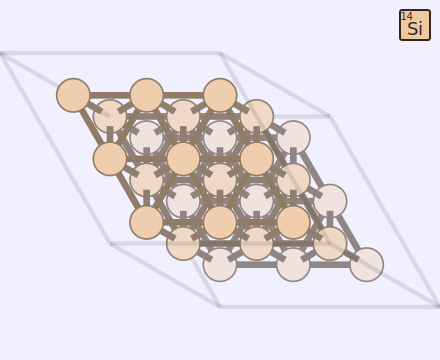
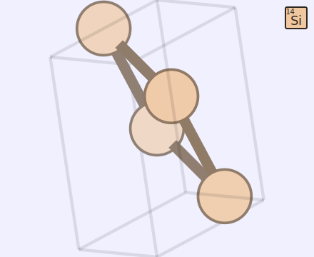
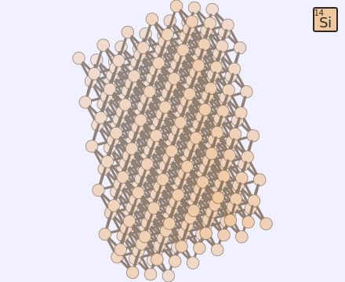
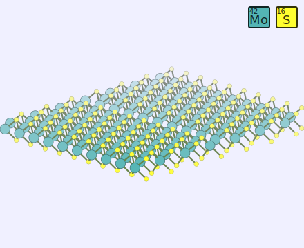
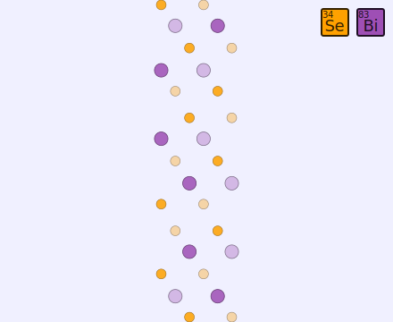

********
Examples
********

To run the examples you have to install all recommended packages, see
corresponding :doc:`section <../install>`.

Atomic structure
================

With DFT Tools you can manipulate crystal structures easily: only very
few lines of code required.

Example: Si unit cell
---------------------

.. plot:: examples/atomic-structure/0-si/plot.py
      :include-source:
      :nofigs:
      :context:
      
.. image:: atomic-structure/0-si/output.svg

One can obtain a supercell by repeating the unit cell:

.. plot:: examples/atomic-structure/0-si/plot2.py
      :include-source:
      :nofigs:
      :context:
      

Arbitrary supercell is available via the corresponding function:

.. plot:: examples/atomic-structure/0-si/plot3.py
      :include-source:
      :nofigs:
      :context:
      

A slab is prepared easily:

.. plot:: examples/atomic-structure/0-si/plot4.py
      :include-source:
      :nofigs:
      :context:
      

Example: Monolayer MoS2 line defect
-----------------------------------

A more complex example: monolayer MoS2 with a line defect:

.. plot:: examples/atomic-structure/1-mos2/plot.py
      :include-source:
      :nofigs:
      :context:
      

Example: parsing structure data
-------------------------------

It is also possible to obtain atomic structure from the supported files.
In this particular case the file source and format can be determined
automatically (OpenMX input file).

.. plot:: examples/atomic-structure/2-bi2se3/plot.py
      :include-source:
      :nofigs:
      :context: reset
      

Example: Moire pattern
-------------------------------

The Moire pattern is obtained using ``UnitCell.supercell``.

.. plot:: examples/atomic-structure/3-graphene/plot.py
      :include-source:
      :nofigs:
      :context: reset
      
.. image:: atomic-structure/3-graphene/output.svg

Band structure
==============

The band structures can be easily plotted directly from the output files.

Example: OpenMX
---------------

In this case to retrieve the band structure we import parser
``dfttools.parsers.openmx.bands`` explicitly.

.. plot:: examples/band-structure/0-openmx-bands/plot.py
      :include-source:

Example: Quantum Espresso
-------------------------

The Quantum Espresso files can be identified automatically via
``dfttools.simple.parse`` routine.

.. plot:: examples/band-structure/1-qe-output/plot.py
      :include-source:

The density of states can be plotted directly from the band structure.
However, one has to note that the density calculated from a k-point path
is usually not the relevant one.

.. plot:: examples/band-structure/1-qe-output/plot2.py
      :include-source:
      
Example: Density of states
--------------------------

To plot an accurate density of states (DoS) a large enough grid is
required. Following is an example of a density of states of graphene.

.. plot:: examples/band-structure/2-graphene/plot.py
      :include-source:
      
Example: K-point grids: density of states and interpolation
-----------------------------------------------------------

They key point of presenting the density of states from a file is
converting the band structure to grid via ``UnitCell.as_grid``. This
only works if you indeed calculated band energies on a grid. Note
that while both ``Grid`` and ``UnitCell`` can be used for DoS, the
former one is considerably more accurate.

.. plot:: examples/band-structure/3-mos2/plot.py
      :include-source:

One can also plot the bands by interpolating data on the grid. The
quality of the figure depends on the grid size and interpolation
methods.

.. plot:: examples/band-structure/3-mos2/plot2.py
      :include-source:

Example: Band structure with weights
------------------------------------

The band structure with weights is plotted using ``weights`` keyword
argument. The weights array is just numbers assigned to each k-point and
each band.

.. plot:: examples/band-structure/4-graphene-weights/plot.py
      :include-source:

Data on the grid
================

Plotting of data (charge, potential, density, etc.) on a 3D grid is very
straightforward.

.. plot:: examples/band-structure/5-scalar/plot.py
      :include-source:
